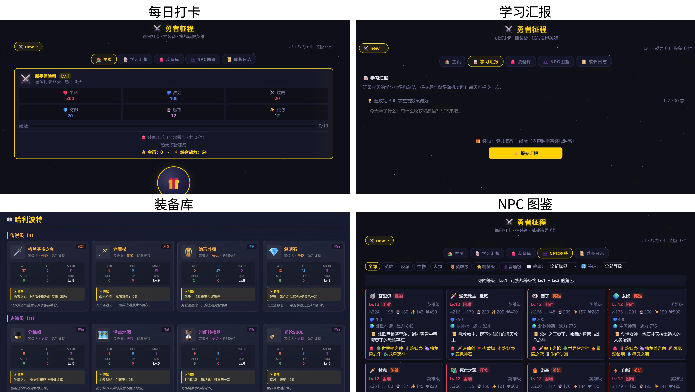

# 勇者征程 · Simple Rewards

> 孩子学习的即时激励工具 —— 完成学习汇报和每日打卡，即可获得丰厚奖励。用抽奖代替游戏的方式，让每一次学习都有成长感。



## 📖 项目简介

**勇者征程**（项目代号：simple-rewards）是一款面向孩子的学习激励工具。通过每日打卡、学习汇报、挑战 NPC 等游戏化机制，将学习转化为有趣的冒险旅程，让孩子在积累知识的同时，也能收获角色成长的成就感。

### 核心理念

- **即时反馈**：每次学习都能立刻看到奖励（装备、经验、属性成长）
- **正向激励**：用游戏化的方式培养学习习惯，而非惩罚
- **多角色支持**：多个孩子可以各有各的角色，互不干扰
- **本地运行**：数据保存在本地，无需联网，保护隐私

## ✨ 功能特性

### 🎁 每日打卡
- 每天打卡获得经验值、属性成长和随机装备
- 连续打卡有额外加成（3天 +15%，5天 +30%）
- 打卡后自动生成当日挑战对手

### 📝 学习汇报
- 每天提交学习心得，获得丰厚奖励
- 学习汇报的奖励 > 打卡 + 挑战的总和（引导孩子重视学习本身）
- 奖励质量根据学习内容的丰富度动态调整
- 建议阅读使用手册，了解如何提交高质量的学习心得，锻炼孩子表达能力

### ⚔️ 挑战系统
- **不速之客**：每天从三位挑战者中挑选一位应战，战胜获得装备
- **主动挑战**：每天可主动挑战3次，自选对手
- **练习模式**：无损耗试手，纯消遣

### 🎒 装备系统
- 5 个稀有度：普通、稀有、史诗、传说、神器
- 6 大装备类型：武器、头盔、铠甲、盾牌、饰品、知识典籍
- 15+ 个世界：哈利波特、魔戒、西游记、中国神话、塞尔达传说……

### 👥 多角色存档
- 支持创建多个角色，每个孩子一个
- 角色数据独立保存，互不影响
- 一键切换角色

### 📚 百科全书
- 收录所有 NPC 和装备的详细资料
- 按世界分类，按等级排序
- 可作为孩子了解各个 IP 的入门指南

## 🚀 快速开始

### 环境要求

- Windows 7/10/11 或 macOS
- Node.js 18 或更高版本（**启动脚本会自动检测并安装**）

### 启动方式

**方式一：双击启动（推荐）**

| 系统 | 操作 |
|------|------|
| **Windows** | 双击 `启动.bat` |
| **macOS** | 双击 `启动.command` |

脚本会自动检测 Node.js，如果未安装则自动下载安装，然后启动服务器。

> macOS 首次运行需要授予执行权限：`chmod +x 启动.command`

**方式二：命令行启动**

```bash
cd simple-rewards
node server.js
```

启动后，在浏览器中打开：`http://localhost:3789`

首次启动会提示创建新角色。

## 📁 项目结构

```
simple-rewards/
├── 勇者征程.html          # 主游戏页面
├── 百科全书.html          # NPC & 装备百科
├── 使用手册.html          # 用户手册（普通用户 + 管理员）
├── game-config.js         # 游戏平衡配置
├── server.js              # 本地服务器（Node.js）
├── 启动.command           # 一键启动脚本（macOS，自动安装 Node.js）
├── 启动.bat               # 一键启动脚本（Windows，自动安装 Node.js）
├── save/                  # 存档目录

```

## 🎮 使用指南

### 普通用户

1. **每日打卡**：每天打开页面，点击宝箱完成打卡，获得奖励
2. **学习汇报**：完成学习后，在「学习汇报」页面写下心得，提交获得更多奖励
3. **挑战对手**：在「主页」挑战 NPC，检验自己的"战力"
4. **收集装备**：通过打卡和挑战收集各种稀有装备
5. **查看百科**：在「百科全书」了解所有 NPC 和装备的背景故事

### 管理员

- **多角色管理**：在角色选择菜单中创建/删除角色
- **数据备份**：使用「导出备份」保存所有进度，「导入备份」恢复
- **手动保存**：点击「立即保存」按钮确保数据写入文件
- **参数调整**：修改 `game-config.js` 调整游戏平衡（经验值、掉落率、属性成长等）

## ⚙️ 配置说明

游戏平衡参数在 `game-config.js` 中，主要包括：

| 参数 | 说明 | 默认值 |
|------|------|--------|
| `xpPerCheckin` | 每次打卡获得的基础经验 | 10 |
| `xpStreak3Bonus` | 连续打卡3天经验加成 | 0.15 (15%) |
| `xpStreak5Bonus` | 连续打卡5天经验加成 | 0.30 (30%) |
| `checkinGains` | 每次打卡的属性成长值 | HP+5, MP+3, ATK+2, DEF+2... |
| `dailyActiveChallenge` | 每日主动挑战次数 | 3 |
| `equipDropRate` | 挑战胜利装备掉落率 | 0.7 (70%) |

## 💾 数据安全

- 所有数据保存在本地 `save/` 目录下
- 建议定期使用「导出备份」功能导出存档文件
- 每个角色一个独立的 JSON 文件，格式透明可编辑
- 支持从旧版存档自动迁移

## 🛠️ 技术栈

- **前端**：原生 HTML/CSS/JavaScript，无框架依赖
- **后端**：Node.js 原生 HTTP 服务器
- **数据存储**：本地 JSON 文件
- **设计风格**：深色奇幻主题，金色点缀

## ⚠️ 项目说明与局限性

这是一个**个人业余项目**，并非专业软件。以下是它的已知局限，使用前请知悉：

### 代码质量
- 前端 HTML、CSS、JS 全部写在单个文件中，没有模块化和工程化

### 游戏平衡
- 数值平衡是凭感觉调的，可能存在过强或过弱的装备/NPC
- 装备特效系统通过解析文字描述来实现，部分特效没有完全还原
- 升级曲线、掉落概率等参数可能需要根据实际使用情况手动调整
- NPC 等级和战力的对应关系是估算的，并非严谨设计

### 安全性
- 数据存在本地 JSON 文件里，没有加密
- 服务器没有身份验证，局域网内其他人也能访问（如果你暴露了端口）
- 没有防作弊机制，懂技术的孩子可以直接改存档
- 不建议部署到公网，仅限家庭内部使用

### 兼容性
- 在 Chrome、Edge、Safari 浏览器上测试过
- 手机端适配一般，建议用电脑或平板
- 服务器端口固定 3789，冲突了需要手动改

### 适合谁用
- ✅ 家长给自家孩子做学习激励
- ✅ 有一定动手能力，愿意自己改配置调参数
- ✅ 不追求完美，能用就行
- ❌ 想要专业、稳定、有售后的产品
- ❌ 多人在线使用
- ❌ 商业用途

**简单说**：这是我做给自己家孩子用的玩具项目，能用，但别期待太高。觉得哪里不好，自己改改就行。

## 📝 版本历史

### v3.1（2025-07-19）
- 🪟 **Windows 支持**：新增 `启动.bat`，自动检测并安装 Node.js
- 🍎 **macOS 启动脚本升级**：`启动.command` 新增自动安装 Node.js
- ⚖️ **装备平衡调整**：平衡饰品、武器、防具的属性，避免数值过强或过弱
- 🐛 **特效解析修复**：修复了部分特效未生效的问题

### v3.0
- 多角色存档系统
- 学习汇报功能
- 主动挑战 + 练习模式
- 百科全书
- 使用手册

### v2.0
- 装备系统重制
- 每日挑战 + 被动应战
- 成长日志

### v1.0
- 基础打卡 + 抽奖功能

## 📄 许可证

本项目采用 [CC BY-NC-SA 4.0](https://creativecommons.org/licenses/by-nc-sa/4.0/)（知识共享-署名-非商业性使用-相同方式共享 4.0 国际许可协议）。

**允许：**
- ✅ 个人学习、参考、修改自用
- ✅ 家庭内部使用
- ✅ 非商业性分享（须署名且以相同方式共享）

**禁止：**
- ❌ 任何形式的商业用途
- ❌ 公开部署或托管为公共服务
- ❌ 以本项目或其衍生品获利

---

**愿每一个孩子都能在学习中找到冒险的乐趣！** ⚔️
